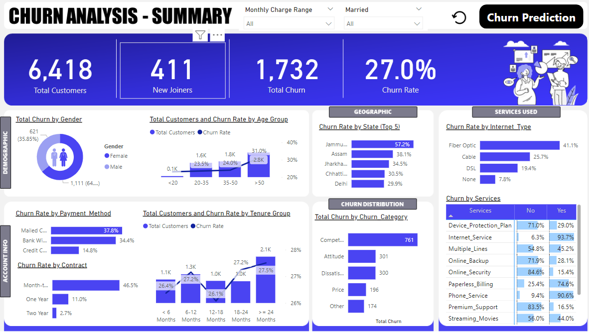

# 🔄 Customer Churn Analysis

## 📌 Overview
An end-to-end churn analysis project using SQL, Python, and Power BI to identify key drivers of customer attrition for a telecom dataset. This project combines data querying, predictive analysis, and interactive dashboarding.

---

## 🛠️ Tools & Technologies


---

## 🎯 Objectives
- Query and explore customer data using SQL
- Perform churn prediction analysis using Python
- Build an interactive Power BI dashboard to visualize churn patterns
- Identify key customer segments most at risk of churning

---

## 📊 Dashboard Preview




---

## 📁 Project Structure
```
Churn-Analysis/
│
├── SQL queries/             # SQL scripts for data extraction & exploration
├── Churn Prediction.ipynb   # Python notebook for churn analysis
├── Churn Analysis.pbix      # Power BI dashboard file
├── Customer_Data.csv        # Raw dataset
├── Churn Prediction.png     # Visualization output
├── Summary.png              # Dashboard summary screenshot
└── README.md
```

---

## 🚀 How to Run

**SQL:**
- Open the `SQL queries/` folder in your preferred SQL client (SSMS / MySQL)
- Run the scripts against the `Customer_Data.csv` dataset

**Python:**
- Install dependencies: `pip install pandas matplotlib seaborn scikit-learn`
- Open `Churn Prediction.ipynb` in Jupyter and run all cells

**Power BI:**
- Open `Churn Analysis.pbix` in Power BI Desktop

---

## 👤 Author
**Kailash Choudhary** | [LinkedIn](https://www.linkedin.com/in/kailash-choudhary-4a770b1bb/) | [GitHub](https://github.com/KailasH1245)
